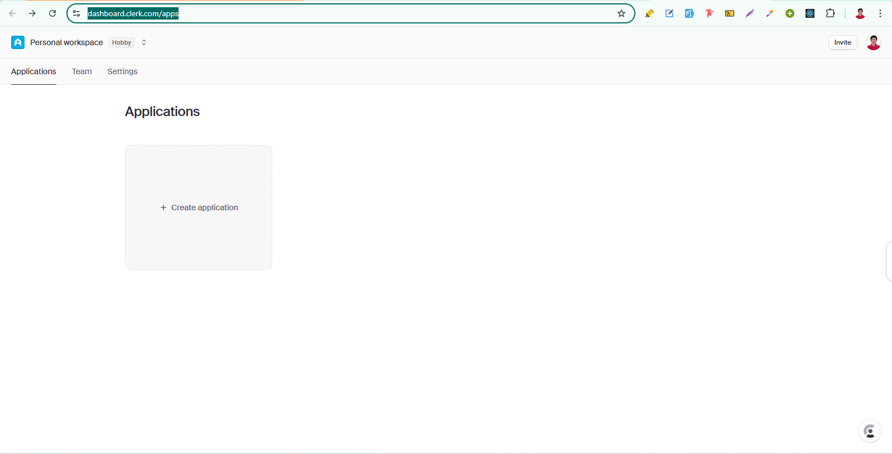
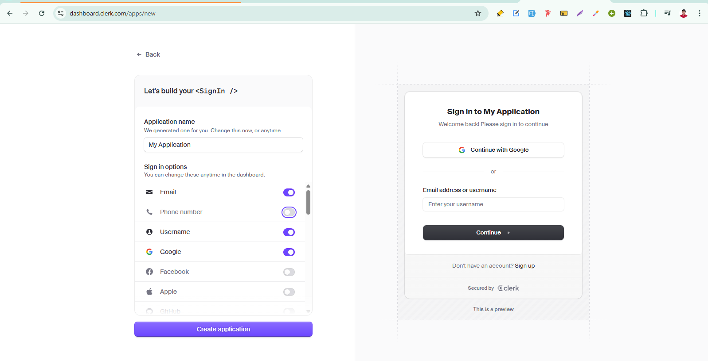
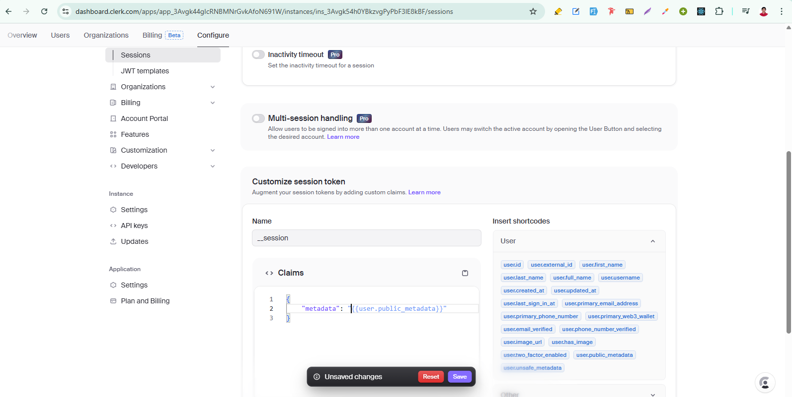
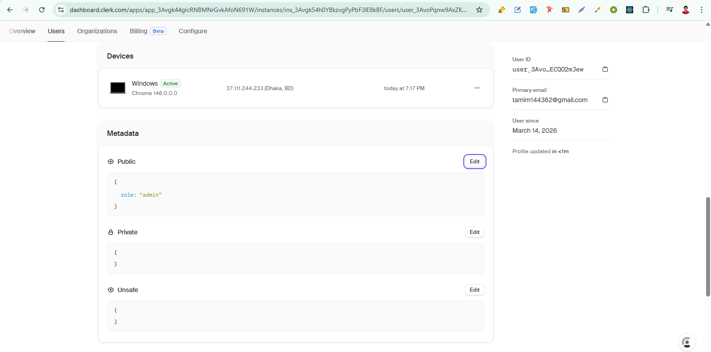

<h1 align="center">Clerk Authentication Notes</h1>

- [Setup:](#setup)
- [clerkMiddleware():](#clerkmiddleware)
  - [Protect routes:](#protect-routes)
    - [Authentication-based protection:](#authentication-based-protection)
    - [Authorization-based protection:](#authorization-based-protection)


# Setup: 
1. Create a Clerk Application:
Go to the Clerk dashboard and create an application. `https://dashboard.clerk.com/apps` and then create an application



2. Choose Authentication providers:
Note: Free tier allows up to 3 social providers.



3. Install clerk:

```
npm install @clerk/nextjs
```

4. Add clerk middleware:

```tsx
// src/proxy.ts

import { clerkMiddleware } from '@clerk/nextjs/server';

export default clerkMiddleware();

export const config = {
  matcher: [
    // Skip Next.js internals and all static files, unless found in search params
    '/((?!_next|[^?]*\\.(?:html?|css|js(?!on)|jpe?g|webp|png|gif|svg|ttf|woff2?|ico|csv|docx?|xlsx?|zip|webmanifest)).*)',
    // Always run for API routes
    '/(api|trpc)(.*)',
  ],
};
```

5. Add clerk provider:

```tsx
// app/layout.tsx

import type { Metadata } from 'next'
import { ClerkProvider } from '@clerk/nextjs'
import './globals.css'

export const metadata: Metadata = {
  title: 'Clerk Next.js Quickstart',
  description: 'Generated by create next app',
}

export default function RootLayout({
  children,
}: Readonly<{
  children: React.ReactNode
}>) {
  return (
    <html lang="en">
      <body>
        <ClerkProvider>{children}</ClerkProvider>
      </body>
    </html>
  )
}
```

6. Now add clerk Component as your requirements (i.e., `<SignInButton />`, `<SignUpButton />` etc): 

```tsx
import type { Metadata } from 'next'
import { ClerkProvider, Show, SignInButton, SignUpButton, UserButton } from '@clerk/nextjs'
import './globals.css'

export const metadata: Metadata = {
  title: 'Clerk Next.js Quickstart',
  description: 'Generated by create next app',
}

export default function RootLayout({
  children,
}: Readonly<{
  children: React.ReactNode
}>) {
  return (
    <html lang="en">
      <body>
        <ClerkProvider>
          <header className="flex justify-end items-center p-4 gap-4 h-16">
            <Show when="signed-out">
              <SignInButton />
              <SignUpButton>
                <button className="btn btn-primary">
                  Sign Up
                </button>
              </SignUpButton>
            </Show>
            <Show when="signed-in">
              <UserButton />
            </Show>
          </header>
          {children}
        </ClerkProvider>
      </body>
    </html>
  )
}
```

7. Set env variables: 


```env
NEXT_PUBLIC_CLERK_PUBLISHABLE_KEY=.........
CLERK_SECRET_KEY=...........
```

# clerkMiddleware(): 
The clerkMiddleware() helper integrates Clerk authentication into your Next.js application through Middleware. 

```tsx
// src/proxy.ts

import { clerkMiddleware } from '@clerk/nextjs/server'

export default clerkMiddleware()

export const config = {
  matcher: [
    // Skip Next.js internals and all static files, unless found in search params
    '/((?!_next|[^?]*\\.(?:html?|css|js(?!on)|jpe?g|webp|png|gif|svg|ttf|woff2?|ico|csv|docx?|xlsx?|zip|webmanifest)).*)',
    // Always run for API routes
    '/(api|trpc)(.*)',
  ],
}
```

## Protect routes:
`createRouteMatcher()` is a Clerk helper function that allows us to protect multiple routes. `createRouteMatcher()` accepts an array of routes and checks if the route the user is trying to visit matches one of the routes passed to it.It returns a function that, if called with the req object from the Middleware, will return true if the user is trying to access a route that matches one of the routes passed to `createRouteMatcher()`.


**Note:** If you have a `<Link>` tag on a public page that points to a protected page that returns a 400-level error, like a 401, the data prefetch will fail because it will be redirected to the sign-in page and throw a confusing error in the console. To prevent this behavior, disable prefetching by adding prefetch={false} to the `<Link>` component.

We can protect routes using either or both of the following:
1. Authentication-based protection: Verify if the user is signed in.
2. Authorization-based protection: Verify if the user has the required Roles.

### Authentication-based protection:
we can protect routes based on a user's authentication status by checking if the user is signed in. For that there are two methods that we can use:

1. auth.protect(): if we want to redirect unauthenticated users to the sign-in route automatically.

```tsx
// src/proxy.ts
import { clerkMiddleware, createRouteMatcher } from '@clerk/nextjs/server'

const isProtectedRoute = createRouteMatcher(['/dashboard(.*)', '/forum(.*)'])

export default clerkMiddleware(async (auth, req) => {
  if (isProtectedRoute(req)) await auth.protect()
})

export const config = {
  matcher: [
    // Skip Next.js internals and all static files, unless found in search params
    '/((?!_next|[^?]*\\.(?:html?|css|js(?!on)|jpe?g|webp|png|gif|svg|ttf|woff2?|ico|csv|docx?|xlsx?|zip|webmanifest)).*)',
    // Always run for API routes
    '/(api|trpc)(.*)',
  ],
}
```

OR: 


```tsx
//src/proxy.ts
import { clerkMiddleware, createRouteMatcher } from '@clerk/nextjs/server'

const isPublicRoute = createRouteMatcher(['/sign-in(.*)', '/sign-up(.*)'])

export default clerkMiddleware(async (auth, req) => {
  if (!isPublicRoute(req)) {
    await auth.protect()
  }
})

export const config = {
  matcher: [
    // Skip Next.js internals and all static files, unless found in search params
    '/((?!_next|[^?]*\\.(?:html?|css|js(?!on)|jpe?g|webp|png|gif|svg|ttf|woff2?|ico|csv|docx?|xlsx?|zip|webmanifest)).*)',
    // Always run for API routes
    '/(api|trpc)(.*)',
  ],
}
```

2. auth().isAuthenticated: if we want more control over what our app does based on user authentication status.

```tsx
// src/proxy.ts
import { clerkMiddleware, createRouteMatcher } from '@clerk/nextjs/server'

const isProtectedRoute = createRouteMatcher(['/dashboard(.*)', '/forum(.*)'])

export default clerkMiddleware(async (auth, req) => {
  const { isAuthenticated, redirectToSignIn } = await auth()

  if (!isAuthenticated && isProtectedRoute(req)) {
    // Add custom logic to run before redirecting

    return redirectToSignIn()
  }
})

export const config = {
  matcher: [
    // Skip Next.js internals and all static files, unless found in search params
    '/((?!_next|[^?]*\\.(?:html?|css|js(?!on)|jpe?g|webp|png|gif|svg|ttf|woff2?|ico|csv|docx?|xlsx?|zip|webmanifest)).*)',
    // Always run for API routes
    '/(api|trpc)(.*)',
  ],
}
```

### Authorization-based protection:
**Note:** This is for learning purpose, but in real apps we won't use clerk based authorization.

For that we need to configure the session token: 



Then manually create the first admin:



```tsx
// types/global.d.ts

export { }

export type Roles = "admin" | "seller" | "user"

declare global {
    interface CustomJwtSessionClaims {
        metadata: {
            role?: Roles
        }
    }
}
```

```tsx
// src/proxy.ts

import { clerkMiddleware, createRouteMatcher } from '@clerk/nextjs/server'
import { NextResponse } from "next/server"

const isProtectedRoute = createRouteMatcher(['/admin(.*)', '/seller(.*)'])

const isAdminRoute = createRouteMatcher(["/admin(.*)"])
const isSellerRoute = createRouteMatcher(["/seller(.*)"])


export default clerkMiddleware(async (auth, req) => {

    if (isProtectedRoute(req)) {
        await auth.protect()
    }

    const { sessionClaims } = await auth()
    const role = sessionClaims?.metadata?.role as string | undefined

    if (isAdminRoute(req) && role !== "admin") {
        return NextResponse.redirect(new URL("/", req.url))
    }
    if (isSellerRoute(req) && role !== "seller") {
        return NextResponse.redirect(new URL("/", req.url))
    }
})

export const config = {
    matcher: [
        // Skip Next.js internals and all static files, unless found in search params
        '/((?!_next|[^?]*\\.(?:html?|css|js(?!on)|jpe?g|webp|png|gif|svg|ttf|woff2?|ico|csv|docx?|xlsx?|zip|webmanifest)).*)',
        // Always run for API routes
        '/(api|trpc)(.*)',
    ],
}
```


```tsx
// src/app/admin/action.ts

"use server"

import { auth, clerkClient } from "@clerk/nextjs/server"
import { revalidatePath } from "next/cache"
import { Roles } from "../../../types/globals"


export async function updateUserRole(formData: FormData) {
    const { sessionClaims, userId } = await auth()

    const currentUserRole = sessionClaims?.metadata?.role

    // 🔐 Only admin can update roles
    if (currentUserRole !== "admin") {
        throw new Error("Unauthorized")
    }

    const id = formData.get("id") as string
    const role = formData.get("role") as Roles

    if (!["admin", "seller", "user"].includes(role as string)) {
        throw new Error("Invalid role")
    }

    if (userId === id) {
        throw new Error("You cannot change your own role")
    }

    const clerk = await clerkClient()

    await clerk.users.updateUserMetadata(id, {
        publicMetadata: { role }
    })

    revalidatePath("/admin")
}
``` 

```tsx
// src/app/admin/page.tsx

import { clerkClient } from "@clerk/nextjs/server"
import { updateUserRole } from "./action"

export default async function AdminHomePage() {
    const clerk = await clerkClient()

    const users = await clerk.users.getUserList()

    return (
        <div className="p-6">
            <h1 className="text-2xl font-bold mb-6">User Management</h1>

            <div className="overflow-x-auto">
                <table className="table table-zebra">
                    <thead>
                        <tr>
                            <th>Name</th>
                            <th>Email</th>
                            <th>Current Role</th>
                            <th>Actions</th>
                        </tr>
                    </thead>

                    <tbody>
                        {users.data.map((user) => {
                            const role = (user.publicMetadata?.role as string) ?? 'user'

                            const email = user.emailAddresses?.[0]?.emailAddress

                            return (
                                <tr key={user.id}>
                                    <td>{user.firstName} {user.lastName}</td>
                                    <td>{email}</td>
                                    <td>
                                        <span className="badge badge-outline">{role}</span>
                                    </td>

                                    <td className="flex gap-2">
                                        {/* Make Admin */}
                                        <form action={updateUserRole}>
                                            <input type="hidden" name="id" value={user.id} />
                                            <input type="hidden" name="role" value="admin" />
                                            <button className="btn btn-xs btn-primary">
                                                Make Admin
                                            </button>
                                        </form>

                                        {/* Make Seller */}
                                        <form action={updateUserRole}>
                                            <input type="hidden" name="id" value={user.id} />
                                            <input type="hidden" name="role" value="seller" />
                                            <button className="btn btn-xs btn-secondary">
                                                Make Seller
                                            </button>
                                        </form>

                                        {/* Make User */}
                                        <form action={updateUserRole}>
                                            <input type="hidden" name="id" value={user.id} />
                                            <input type="hidden" name="role" value="user" />
                                            <button className="btn btn-xs">
                                                Make User
                                            </button>
                                        </form>
                                    </td>
                                </tr>
                            )
                        })}
                    </tbody>
                </table>
            </div>
        </div>
    )
}
```


