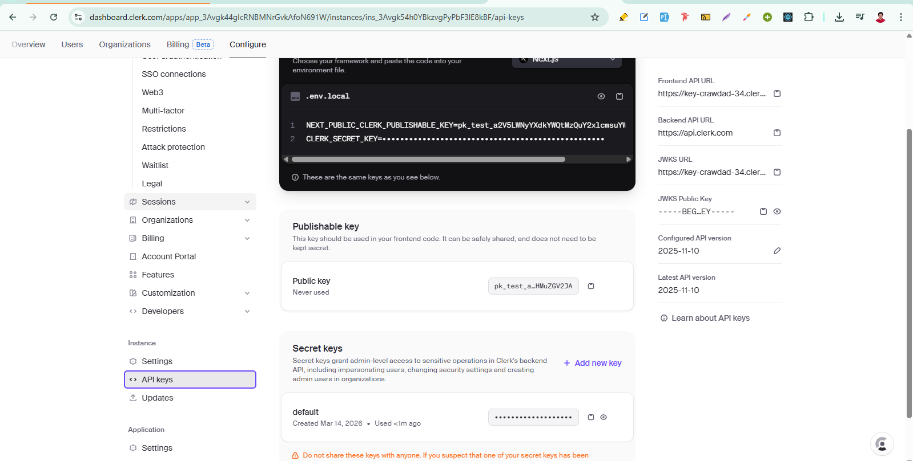

<h1 align="center">Clerk Authentication Notes</h1>

- [Setup:](#setup)
- [Components:](#components)
  - [Authentication components:](#authentication-components)
  - [User components:](#user-components)
  - [Control components:](#control-components)
  - [Unstyled components:](#unstyled-components)

# Setup: 
1. Create a Clerk Application:
Go to the Clerk dashboard and create an application. `https://dashboard.clerk.com/apps` and then create an application


2. Choose Authentication providers:
Note: Free tier allows up to 3 social providers.


3. Install clerk:

```
npm install @clerk/nextjs
```

4. Add clerk middleware:

```tsx
// src/proxy.ts

import { clerkMiddleware } from '@clerk/nextjs/server';

export default clerkMiddleware();

export const config = {
  matcher: [
    // Skip Next.js internals and all static files, unless found in search params
    '/((?!_next|[^?]*\\.(?:html?|css|js(?!on)|jpe?g|webp|png|gif|svg|ttf|woff2?|ico|csv|docx?|xlsx?|zip|webmanifest)).*)',
    // Always run for API routes
    '/(api|trpc)(.*)',
  ],
};
```

5. Add clerk provider:

```tsx
// app/layout.tsx

import type { Metadata } from 'next'
import { ClerkProvider } from '@clerk/nextjs'
import './globals.css'

export const metadata: Metadata = {
  title: 'Clerk Next.js Quickstart',
  description: 'Generated by create next app',
}

export default function RootLayout({
  children,
}: Readonly<{
  children: React.ReactNode
}>) {
  return (
    <html lang="en">
      <body>
        <ClerkProvider>{children}</ClerkProvider>
      </body>
    </html>
  )
}
```

6. Now add clerk Component as your requirements (i.e., `<SignInButton />`, `<SignUpButton />` etc): 

```tsx
import type { Metadata } from 'next'
import { ClerkProvider, Show, SignInButton, SignUpButton, UserButton } from '@clerk/nextjs'
import './globals.css'

export const metadata: Metadata = {
  title: 'Clerk Next.js Quickstart',
  description: 'Generated by create next app',
}

export default function RootLayout({
  children,
}: Readonly<{
  children: React.ReactNode
}>) {
  return (
    <html lang="en">
      <body>
        <ClerkProvider>
          <header className="flex justify-end items-center p-4 gap-4 h-16">
            <Show when="signed-out">
              <SignInButton />
              <SignUpButton>
                <button className="btn btn-primary">
                  Sign Up
                </button>
              </SignUpButton>
            </Show>
            <Show when="signed-in">
              <UserButton />
            </Show>
          </header>
          {children}
        </ClerkProvider>
      </body>
    </html>
  )
}
```

7. Set env variables: 



```env
NEXT_PUBLIC_CLERK_PUBLISHABLE_KEY=.........
CLERK_SECRET_KEY=...........
```

